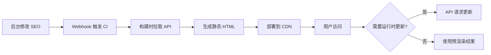

# React 多页 SEO 应用技术方案（完整版）

> 基于 zelos-website (Vue 2.7 MPA) 项目经验的 React 版本技术方案
>
> 版本: v2.0 | 创建时间: 2026-01-07 | 最后更新: 2026-01-07

---

## 目录

- [1. 项目概述](#1-项目概述)
- [2. 方案分级说明](#2-方案分级说明)
- [3. 技术栈选型](#3-技术栈选型)
- [4. 架构设计](#4-架构设计)
- [5. SEO 优化方案](#5-seo-优化方案)
- [6. 响应式设计方案](#6-响应式设计方案)
- [7. 动画方案](#7-动画方案)
- [8. 浏览器与设备兼容性](#8-浏览器与设备兼容性)
- [9. 工程化配置](#9-工程化配置)
- [10. 性能优化策略](#10-性能优化策略)
- [11. 测试策略](#11-测试策略)
- [12. 监控与日志](#12-监控与日志)
- [13. 多站点/多语言支持](#13-多站点多语言支持)
- [14. 升级路径](#14-升级路径)
- [15. 实施路线图](#15-实施路线图)
- [16. 风险与注意事项](#16-风险与注意事项)
- [17. 参考资料](#17-参考资料)

---

## 1. 项目概述

### 1.1 项目目标

构建一个企业级的 React 多页面应用（MPA），用于官网展示，具备完善的 SEO 支持、丰富的动画效果、优秀的兼容性和工程化能力。

### 1.2 核心需求

| 需求项 | 描述 | 优先级 |
| ------ | ---- | ------ |
| 多页应用架构 | 每个页面独立打包，支持独立部署和缓存策略 | P0 |
| SEO 优化 | 搜索引擎可索引，支持自定义 meta、OG 标签、结构化数据 | P0 |
| 技术栈 | React 18 + TypeScript + Hooks | P0 |
| 动画效果 | 丰富的页面过渡、滚动动画、交互动画 | P0 |
| 响应式设计 | PC 端和移动端适配，部分模块分端展示 | P0 |
| 浏览器兼容 | 支持主流浏览器及其近 2 个版本，国内浏览器兼容 | P0 |
| 设备兼容 | 支持低端设备和老旧设备的降级方案 | P0 |
| 工程化 | 企业级构建优化、代码规范、性能优化 | P0 |

### 1.3 当前 Vue 项目核心优势（可复用经验）

- ✅ **多页面架构成熟**: 12 个独立页面入口，每个页面单独打包
- ✅ **SEO 方案完善**: API 驱动的 SEO 配置，挂载前注入
- ✅ **响应式架构清晰**: PC/移动端组件完全分离
- ✅ **动画库丰富**: fullpage.js、swiper、AOS、animate.css 集成良好
- ✅ **构建优化充分**: Gzip、Chunk 控制、去除 console 等
- ✅ **多站点支持**: 通过环境变量实现国际站/中国站切换

---

## 2. 方案分级说明

### 2.1 分级策略

本方案采用 **"基础版 (MVP) + 可选增强 + 升级路径"** 的分级设计，既保证快速落地，又预留企业级扩展空间。

| 层级 | 说明 | 适用场景 | 预估周期 |
| ---- | ---- | -------- | -------- |
| **基础版 (MVP)** | 核心功能可落地，满足官网上线需求 | 初期快速上线、内容静态、发布频率低 | 8-12 周 |
| **可选增强** | 按需启用的高级功能，提升用户体验和运维效率 | 业务扩展、运营活动、性能优化需求 | 按需 |
| **升级路径** | 当业务需求超出当前方案时的技术升级方案 | CMS实时内容、高频更新、动态个性化 | 4-6 周 |

### 2.2 分级内容概览

#### 基础版 (MVP)

- ✅ Vite MPA 多页面架构
- ✅ 预渲染 SEO（构建时注入 + 静态 HTML 兜底）
- ✅ PC/移动端响应式（组件级别切换）
- ✅ 基础动画（Framer Motion + Swiper）
- ✅ 浏览器兼容（Chrome/Edge/Safari/Firefox 近 2 个版本 + 国内浏览器）
- ✅ 最小化测试（单元测试核心工具 + E2E 关键流程 + Lighthouse CI）
- ✅ 基础监控（Sentry 错误捕获）
- ✅ 基础工程化（ESLint + Prettier + Husky + 构建优化）

#### 可选增强

- 🔧 运行时 SEO 更新（A/B 测试、紧急修正）
- 🔧 完整测试体系（组件测试 + 视觉回归）
- 🔧 性能监控（Web Vitals + 自定义埋点）
- 🔧 多站点/多语言（hreflang + 国际化）
- 🔧 CMS 集成（Headless CMS + 内容管理）
- 🔧 高级动画（GSAP + ScrollTrigger + 复杂时间线）
- 🔧 PWA 支持（Service Worker + 离线访问）

#### 升级路径

- 🚀 升级到 Next.js（SSR/ISR/Edge Functions）
- 🚀 引入 Astro（极致性能、多框架混用）
- 🚀 动态内容方案（API Routes + 服务端个性化）

---

## 3. 技术栈选型

### 3.1 核心技术栈（基础版）

| 类别 | 技术选型 | 版本 | 选择理由 |
| ---- | -------- | ---- | -------- |
| **框架** | React | 18.x | 最新稳定版本，支持并发特性 |
| **类型系统** | TypeScript | 5.x | 类型安全，提升开发体验 |
| **构建工具** | Vite | 5.x | 快速的开发体验，原生 ESM 支持，MPA 配置简单 |
| **CSS 方案** | Tailwind CSS + CSS Modules | - | 原子化 CSS + 模块化样式，响应式友好 |
| **状态管理** | Zustand | 4.x | 轻量级，适合多页应用局部状态管理 |
| **路由** | 无需 SPA 路由 | - | MPA 通过原生 HTML 跳转 |
| **HTTP 客户端** | Axios | 1.x | 成熟稳定，拦截器功能强大 |

### 3.2 动画与交互库

| 类别 | 技术选型 | 使用场景 | Bundle 大小 (gzip) |
| ---- | -------- | -------- | ------------------ |
| **页面动画** | Framer Motion | 页面过渡、layout 动画 | ~80KB |
| **滚动动画** | Framer Motion + useInView | 元素进入视口动画 | 包含在上方 |
| **轮播组件** | Swiper React | 图片轮播、产品展示 | ~45KB |
| **全屏滚动** | react-fullpage (可选) | 首页全屏滚动效果 | ~25KB |
| **复杂时间线** | GSAP + ScrollTrigger (可选增强) | 重度滚动驱动动画 | ~70KB |

**使用规范**：

- ✅ Framer Motion: 仅在需要 layout animation 的页面使用
- ✅ 重度滚动动画: 改用 CSS + Intersection Observer 或 GSAP
- ✅ 通过 Vite manualChunks 分离，避免每个入口重复加载

### 3.3 兼容性工具

| 类别 | 技术选型 | 用途 |
| ---- | -------- | ---- |
| **Polyfill** | @vitejs/plugin-legacy + core-js | 支持 ES5 浏览器 |
| **CSS 兼容** | Autoprefixer + PostCSS | 自动添加浏览器前缀 |
| **图片兼容** | vite-plugin-imagemin | WebP/AVIF 降级到 JPEG/PNG |
| **字体兼容** | WOFF2 + WOFF + TTF | 多格式字体支持 |

### 3.4 工程化工具

| 类别 | 技术选型 | 用途 |
| ---- | -------- | ---- |
| **代码规范** | ESLint + Prettier | 代码风格统一 |
| **Git Hooks** | Husky + lint-staged | 提交前代码检查 |
| **包管理器** | pnpm | 节省磁盘空间，依赖管理清晰 |
| **环境变量** | dotenv + Vite env | 多环境配置管理 |
| **打包优化** | vite-plugin-compression + vite-plugin-imagemin | Gzip、图片压缩 |
| **打包分析** | rollup-plugin-visualizer | 分析打包体积 |

---

## 4. 架构设计

### 4.1 多页面架构方案

#### 方案对比

| 方案 | 优点 | 缺点 | 推荐度 | 适用场景 |
| ---- | ---- | ---- | ------ | -------- |
| **Vite MPA** | 开发体验好，配置简单，构建速度快，纯静态部署 | 生态相对较新，不支持 SSR | ⭐⭐⭐⭐⭐ | 静态内容、发布频率低 |
| **Webpack MPA** | 生态成熟，配置灵活，插件丰富 | 配置复杂，构建速度慢 | ⭐⭐⭐ | 需要复杂 loader 或 legacy 支持 |
| **Next.js SSG** | SEO 自动优化，支持 SSR/SSG/ISR，内置 Image 优化 | 需要 Node 服务器，相对重量级 | ⭐⭐⭐⭐ | CMS 实时内容、高频更新 |
| **Astro Islands** | 极致性能，零 JS 默认，支持多框架 | 不适合重交互应用，生态较新 | ⭐⭐⭐ | 内容为主、交互少 |

**最终选择: Vite MPA（基础版）**

**选择理由**：

- ✅ 内容静态，发布频率低（符合官网特性）
- ✅ 纯静态部署，成本低，运维简单
- ✅ 开发体验好，团队快速上手
- ✅ 与现有 Vue 项目架构相似，迁移思路清晰

**何时升级到 Next.js**（见第 14 章）

### 4.2 目录结构设计

```text
react-official-website/
├── public/                     # 静态资源
│   ├── favicon.ico
│   ├── robots.txt
│   ├── sitemap.xml
│   └── images/
│       ├── desktop/            # PC 端图片
│       └── mobile/             # 移动端图片
│
├── src/
│   ├── api/                    # API 服务层
│   │   ├── client.ts           # Axios 实例配置
│   │   ├── interceptors.ts     # 拦截器（请求/响应）
│   │   └── services/           # 业务接口
│   │       ├── common.ts       # 公共接口（导航、页脚）
│   │       ├── seo.ts          # SEO 配置接口
│   │       ├── content.ts      # 内容接口
│   │       └── form.ts         # 表单提交接口
│   │
│   ├── components/             # 公共组件
│   │   ├── layout/
│   │   │   ├── Header/         # PC 头部
│   │   │   │   ├── index.tsx
│   │   │   │   └── index.module.css
│   │   │   ├── Footer/         # PC 页脚
│   │   │   ├── MobileHeader/   # 移动端头部
│   │   │   └── MobileFooter/   # 移动端页脚
│   │   │
│   │   ├── animations/         # 动画组件
│   │   │   ├── FadeIn.tsx      # 淡入动画
│   │   │   ├── SlideUp.tsx     # 向上滑动
│   │   │   ├── ScrollReveal.tsx # 滚动触发动画
│   │   │   └── PageTransition.tsx # 页面过渡
│   │   │
│   │   └── common/             # 通用组件
│   │       ├── Button/
│   │       ├── Modal/
│   │       ├── Form/
│   │       ├── Image/          # 响应式图片组件
│   │       └── LazyLoad/       # 懒加载组件
│   │
│   ├── pages/                  # 页面目录
│   │   ├── index/              # 首页
│   │   │   ├── main.tsx        # 页面入口
│   │   │   ├── App.tsx         # 根组件（响应式切换）
│   │   │   ├── Desktop.tsx     # PC 版本
│   │   │   ├── Mobile.tsx      # 移动端版本
│   │   │   ├── components/     # 页面专属组件
│   │   │   │   ├── Hero/
│   │   │   │   ├── Features/
│   │   │   │   └── Partners/
│   │   │   └── styles/         # 页面样式
│   │   │       ├── desktop.module.css
│   │   │       └── mobile.module.css
│   │   │
│   │   ├── about/              # 关于我们
│   │   ├── products/           # 产品页
│   │   ├── news/               # 新闻列表
│   │   ├── news-detail/        # 新闻详情
│   │   └── ...                 # 其他页面
│   │
│   ├── hooks/                  # 自定义 Hooks
│   │   ├── useResponsive.ts    # 响应式检测
│   │   ├── useSEO.ts           # SEO 配置
│   │   ├── useScrollAnimation.ts # 滚动动画
│   │   ├── useI18n.ts          # 国际化
│   │   ├── useDevice.ts        # 设备检测
│   │   └── useIntersection.ts  # Intersection Observer
│   │
│   ├── utils/                  # 工具函数
│   │   ├── seo.ts              # SEO 工具
│   │   ├── device.ts           # 设备检测
│   │   ├── browser.ts          # 浏览器检测
│   │   ├── animation.ts        # 动画工具
│   │   ├── compatibility.ts    # 兼容性检测
│   │   ├── polyfill.ts         # Polyfill 加载
│   │   └── constants.ts        # 常量配置
│   │
│   ├── styles/                 # 全局样式
│   │   ├── globals.css         # 全局样式
│   │   ├── variables.css       # CSS 变量
│   │   ├── animations.css      # 动画定义
│   │   ├── tailwind.css        # Tailwind 入口
│   │   └── compatibility.css   # 兼容性样式
│   │
│   └── types/                  # TypeScript 类型定义
│       ├── api.d.ts
│       ├── components.d.ts
│       ├── env.d.ts
│       └── global.d.ts
│
├── scripts/                    # 构建脚本
│   ├── prerender.ts            # 预渲染脚本
│   ├── seo-fetch.ts            # SEO 配置获取
│   └── optimize.ts             # 优化脚本
│
├── index.html                  # 首页 HTML 模板
├── about.html                  # 关于我们 HTML 模板
├── products.html               # 产品页 HTML 模板
├── ...                         # 其他页面 HTML 模板
│
├── vite.config.ts              # Vite 配置
├── tsconfig.json               # TypeScript 配置
├── tailwind.config.js          # Tailwind 配置
├── postcss.config.js           # PostCSS 配置
├── .env.development            # 开发环境变量
├── .env.production             # 生产环境变量
├── .env.staging                # 预发环境变量
├── .eslintrc.js                # ESLint 配置
├── .prettierrc.js              # Prettier 配置
├── .browserslistrc             # 浏览器兼容列表
└── package.json
```

### 4.3 页面架构规范

每个页面遵循统一的结构模式：

#### HTML 模板（index.html）

```html
<!DOCTYPE html>
<html lang="zh-CN">
<head>
  <meta charset="UTF-8">
  <meta name="viewport" content="width=device-width, initial-scale=1.0, maximum-scale=5.0">
  <meta http-equiv="X-UA-Compatible" content="IE=edge">

  <!-- SEO meta 标签（构建时注入） -->
  <title>九时科技 - 加载中...</title>
  <meta name="description" content="">
  <meta name="keywords" content="">

  <!-- Open Graph -->
  <meta property="og:type" content="website">
  <meta property="og:title" content="">
  <meta property="og:description" content="">
  <meta property="og:image" content="">
  <meta property="og:url" content="">

  <!-- Canonical -->
  <link rel="canonical" href="">

  <!-- DNS 预解析 -->
  <link rel="dns-prefetch" href="https://api.example.com">

  <!-- 预连接 -->
  <link rel="preconnect" href="https://cdn.example.com" crossorigin>

  <!-- Favicon -->
  <link rel="icon" type="image/x-icon" href="/favicon.ico">
  <link rel="apple-touch-icon" href="/apple-touch-icon.png">
</head>
<body>
  <div id="root"></div>
  <script type="module" src="/src/pages/index/main.tsx"></script>

  <!-- 不支持 JavaScript 的提示 -->
  <noscript>
    <div style="text-align:center;padding:50px;">
      <p>请启用 JavaScript 以获得更好的体验。</p>
      <p>Please enable JavaScript for a better experience.</p>
    </div>
  </noscript>
</body>
</html>
```

#### 页面入口（main.tsx）

```typescript
import React from 'react'
import ReactDOM from 'react-dom/client'
import App from './App'
import { fetchPageSEO, injectSEO } from '@/utils/seo'
import { checkCompatibility } from '@/utils/compatibility'
import '@/styles/globals.css'
import './styles/desktop.module.css'

// 兼容性检测
checkCompatibility()

// 初始化应用
async function initApp() {
  try {
    // 1. 获取 SEO 配置（如果预渲染失败）
    const seoConfig = await fetchPageSEO('home')

    // 2. 注入 SEO 信息（补充或修正）
    injectSEO(seoConfig)
  } catch (error) {
    console.error('Failed to load SEO config:', error)
    // SEO 失败不阻塞页面渲染
  } finally {
    // 3. 挂载 React 应用
    ReactDOM.createRoot(document.getElementById('root')!).render(
      <React.StrictMode>
        <App />
      </React.StrictMode>
    )
  }
}

initApp()
```

#### 根组件（App.tsx）

```typescript
import { useEffect, useState } from 'react'
import Desktop from './Desktop'
import Mobile from './Mobile'
import { useResponsive } from '@/hooks/useResponsive'

export default function App() {
  const { isMobile } = useResponsive()

  // 动态加载不同的组件树
  return isMobile ? <Mobile /> : <Desktop />
}
```

---

## 5. SEO 优化方案

### 5.1 SEO 实现策略（基础版）

**核心策略：预渲染为主 + 运行时为辅**

| 阶段 | 实现方式 | 优先级 | 说明 |
| ---- | -------- | ------ | ---- |
| **构建时预渲染** | Vite 插件 + API 拉取 | P0 | 生成静态 HTML，包含完整 SEO 信息（兜底方案） |
| **运行时更新** | 挂载前 API 请求 | P1 | A/B 测试、紧急修正（可选） |
| **Sitemap 生成** | 构建脚本自动生成 | P0 | XML sitemap + robots.txt |
| **结构化数据** | JSON-LD 注入 | P1 | Schema.org 企业信息、面包屑等 |

#### 实施流程



### 5.2 SEO 工具实现

#### seo.ts

```typescript
export interface SEOConfig {
  title: string
  keywords: string
  description: string
  ogImage?: string
  ogUrl?: string
  canonical?: string
  hreflang?: Array<{ lang: string; url: string }>
  structuredData?: Record<string, any>
}

/**
 * 注入 SEO 信息到 DOM
 */
export function injectSEO(config: SEOConfig) {
  const { title, keywords, description, ogImage, ogUrl, canonical, hreflang, structuredData } = config

  // 设置 title
  if (title) {
    document.title = title
  }

  // 设置 meta 标签
  setMeta('keywords', keywords)
  setMeta('description', description)

  // 设置 Open Graph
  setOgMeta('og:title', title)
  setOgMeta('og:description', description)
  if (ogImage) setOgMeta('og:image', ogImage)
  if (ogUrl) setOgMeta('og:url', ogUrl)

  // 设置 Canonical
  if (canonical) {
    setLink('canonical', canonical)
  }

  // 设置 hreflang（国际化）
  if (hreflang && hreflang.length > 0) {
    hreflang.forEach(({ lang, url }) => {
      setLink('alternate', url, { hreflang: lang })
    })
  }

  // 设置结构化数据
  if (structuredData) {
    injectStructuredData(structuredData)
  }
}

function setMeta(name: string, content: string) {
  if (!content) return
  let element = document.querySelector(`meta[name="${name}"]`)
  if (!element) {
    element = document.createElement('meta')
    element.setAttribute('name', name)
    document.head.appendChild(element)
  }
  element.setAttribute('content', content)
}

function setOgMeta(property: string, content: string) {
  if (!content) return
  let element = document.querySelector(`meta[property="${property}"]`)
  if (!element) {
    element = document.createElement('meta')
    element.setAttribute('property', property)
    document.head.appendChild(element)
  }
  element.setAttribute('content', content)
}

function setLink(rel: string, href: string, attrs?: Record<string, string>) {
  let element = document.querySelector(`link[rel="${rel}"]`)
  if (!element) {
    element = document.createElement('link')
    element.setAttribute('rel', rel)
    document.head.appendChild(element)
  }
  element.setAttribute('href', href)
  if (attrs) {
    Object.entries(attrs).forEach(([key, value]) => {
      element!.setAttribute(key, value)
    })
  }
}

function injectStructuredData(data: Record<string, any>) {
  const script = document.createElement('script')
  script.type = 'application/ld+json'
  script.text = JSON.stringify(data)
  document.head.appendChild(script)
}

/**
 * 从 API 获取 SEO 配置
 */
export async function fetchPageSEO(page: string): Promise<SEOConfig> {
  try {
    const response = await fetch(`${import.meta.env.VITE_API_BASE_URL}/api/seo/${page}`)
    return response.json()
  } catch (error) {
    console.error('Failed to fetch SEO config:', error)
    // 返回默认配置
    return {
      title: '九时科技',
      keywords: '',
      description: '',
    }
  }
}
```

### 5.3 预渲染配置

#### 方案选择

| 方案 | 工具 | 优点 | 缺点 |
| ---- | ---- | ---- | ---- |
| Vite 插件 | vite-plugin-prerender | 配置简单，集成度高 | 功能相对简单 |
| React Snap | react-snap | 成熟稳定，支持复杂场景 | 配置稍复杂 |
| 自定义脚本 | Puppeteer + Node | 完全可控，灵活度高 | 开发成本高 |

**推荐：自定义脚本（构建时拉取 API + 注入 HTML）**

#### scripts/prerender.ts

```typescript
import fs from 'fs'
import path from 'path'
import { fetchPageSEO } from '../src/utils/seo'

const pages = [
  { name: 'index', path: '/index.html', seoKey: 'home' },
  { name: 'about', path: '/about.html', seoKey: 'about' },
  { name: 'products', path: '/products.html', seoKey: 'products' },
  // ... 更多页面
]

async function prerender() {
  for (const page of pages) {
    // 1. 读取构建后的 HTML
    const htmlPath = path.resolve(__dirname, `../dist${page.path}`)
    let html = fs.readFileSync(htmlPath, 'utf-8')

    // 2. 获取 SEO 配置
    const seoConfig = await fetchPageSEO(page.seoKey)

    // 3. 注入 SEO 信息到 HTML
    html = injectSEOToHTML(html, seoConfig)

    // 4. 写回文件
    fs.writeFileSync(htmlPath, html)

    console.log(`✅ Prerendered: ${page.name}`)
  }
}

function injectSEOToHTML(html: string, seo: SEOConfig): string {
  // 替换 title
  html = html.replace(/<title>.*?<\/title>/, `<title>${seo.title}</title>`)

  // 替换或添加 meta 标签
  // ... (具体实现)

  return html
}

prerender()
```

### 5.4 Sitemap 和 robots.txt

#### public/sitemap.xml

```xml
<?xml version="1.0" encoding="UTF-8"?>
<urlset xmlns="http://www.sitemaps.org/schemas/sitemap/0.9">
  <url>
    <loc>https://example.com/</loc>
    <lastmod>2026-01-07</lastmod>
    <priority>1.0</priority>
    <changefreq>weekly</changefreq>
  </url>
  <url>
    <loc>https://example.com/about.html</loc>
    <lastmod>2026-01-07</lastmod>
    <priority>0.8</priority>
    <changefreq>monthly</changefreq>
  </url>
  <!-- 更多页面，构建时自动生成 -->
</urlset>
```

#### public/robots.txt

```text
# 允许所有爬虫
User-agent: *
Allow: /

# Sitemap
Sitemap: https://example.com/sitemap.xml

# 不允许爬取的路径（如果有）
Disallow: /admin/
Disallow: /api/
```

### 5.5 结构化数据（Schema.org）

```typescript
// 企业信息
const organizationSchema = {
  '@context': 'https://schema.org',
  '@type': 'Organization',
  name: '九时科技',
  url: 'https://example.com',
  logo: 'https://example.com/logo.png',
  description: '企业描述',
  address: {
    '@type': 'PostalAddress',
    addressCountry: 'CN',
    addressLocality: '北京',
  },
  contactPoint: {
    '@type': 'ContactPoint',
    telephone: '+86-xxx-xxxx',
    contactType: 'customer service',
  },
  sameAs: [
    'https://twitter.com/example',
    'https://linkedin.com/company/example',
  ],
}

// 面包屑导航
const breadcrumbSchema = {
  '@context': 'https://schema.org',
  '@type': 'BreadcrumbList',
  itemListElement: [
    {
      '@type': 'ListItem',
      position: 1,
      name: '首页',
      item: 'https://example.com',
    },
    {
      '@type': 'ListItem',
      position: 2,
      name: '产品',
      item: 'https://example.com/products.html',
    },
  ],
}
```

---

## 6. 响应式设计方案

### 6.1 响应式策略

采用 **组件级别的响应式切换**，而非 CSS 媒体查询隐藏显示。

| 方案 | 实现方式 | 优点 | 缺点 |
| ---- | -------- | ---- | ---- |
| CSS 媒体查询隐藏 | display: none | 实现简单 | 移动端仍加载 PC 代码，浪费资源 |
| 组件级别切换 | 根据屏幕宽度加载不同组件 | 按需加载，性能好 | 实现稍复杂 |

**推荐：组件级别切换**

#### useResponsive Hook

```typescript
import { useState, useEffect } from 'react'

const BREAKPOINTS = {
  mobile: 768,
  tablet: 1024,
  desktop: 1280,
}

export function useResponsive() {
  const [windowWidth, setWindowWidth] = useState(
    typeof window !== 'undefined' ? window.innerWidth : BREAKPOINTS.desktop
  )

  useEffect(() => {
    const handleResize = () => {
      setWindowWidth(window.innerWidth)
    }

    window.addEventListener('resize', handleResize)
    return () => window.removeEventListener('resize', handleResize)
  }, [])

  return {
    isMobile: windowWidth < BREAKPOINTS.mobile,
    isTablet: windowWidth >= BREAKPOINTS.mobile && windowWidth < BREAKPOINTS.tablet,
    isDesktop: windowWidth >= BREAKPOINTS.tablet,
    windowWidth,
  }
}
```

### 6.2 Tailwind CSS 响应式

```jsx
<div className="
  px-4 py-6           /* 移动端：默认 */
  md:px-8 md:py-12   /* 平板：≥768px */
  lg:px-16 lg:py-20  /* 桌面：≥1024px */
  xl:px-24 xl:py-28  /* 大屏：≥1280px */
">
  内容
</div>
```

### 6.3 分端组件示例

```typescript
// pages/index/App.tsx
import { lazy, Suspense } from 'react'
import { useResponsive } from '@/hooks/useResponsive'
import Loading from '@/components/common/Loading'

// 懒加载分端组件
const Desktop = lazy(() => import('./Desktop'))
const Mobile = lazy(() => import('./Mobile'))

export default function App() {
  const { isMobile } = useResponsive()

  return (
    <Suspense fallback={<Loading />}>
      {isMobile ? <Mobile /> : <Desktop />}
    </Suspense>
  )
}
```

### 6.4 响应式图片

#### 方案 1: picture 标签

```jsx
<picture>
  <source media="(max-width: 768px)" srcSet="/images/hero-mobile.webp" type="image/webp" />
  <source media="(max-width: 768px)" srcSet="/images/hero-mobile.jpg" />
  <source media="(min-width: 769px)" srcSet="/images/hero-desktop.webp" type="image/webp" />
  <source media="(min-width: 769px)" srcSet="/images/hero-desktop.jpg" />
  
</picture>
```

#### 方案 2: 响应式图片组件

```typescript
interface ResponsiveImageProps {
  src: {
    mobile: string
    desktop: string
  }
  alt: string
  loading?: 'lazy' | 'eager'
}

export function ResponsiveImage({ src, alt, loading = 'lazy' }: ResponsiveImageProps) {
  const { isMobile } = useResponsive()

  return (
    
  )
}
```

---

## 8. 浏览器与设备兼容性

### 8.1 浏览器兼容目标

#### 支持的浏览器（基础版）

| 浏览器 | 版本 | 市场份额 | 优先级 |
| ------ | ---- | -------- | ------ |
| Chrome | 最近 2 个版本 | ~65% | P0 |
| Edge | 最近 2 个版本 | ~10% | P0 |
| Safari | 最近 2 个版本 | ~15% | P0 |
| Firefox | 最近 2 个版本 | ~5% | P0 |
| **国内浏览器** | | | |
| 360 安全浏览器 | 最新版 | ~5% (中国) | P0 |
| QQ 浏览器 | 最新版 | ~3% (中国) | P1 |
| UC 浏览器 | 最新版 | ~2% (中国) | P1 |
| **移动端** | | | |
| Chrome Android | 最近 2 个版本 | ~45% | P0 |
| Safari iOS | 最近 2 个版本 | ~30% | P0 |
| 微信内置浏览器 | 最新版 | ~15% (中国) | P0 |

#### 降级支持的浏览器（可选增强）

| 浏览器 | 版本 | 策略 |
| ------ | ---- | ---- |
| IE 11 | 11 | 显示不支持提示，提供基础样式 |
| Chrome | <90 | Polyfill + 降级动画 |
| Safari | <14 | Polyfill + 降级 CSS |

### 8.2 .browserslistrc 配置

```text
# 生产环境
> 0.5%
last 2 versions
not dead
not IE 11

# 中国市场
> 0.2% in CN
```

### 8.3 Polyfill 策略

#### 方案 1: @vitejs/plugin-legacy（推荐）

```typescript
// vite.config.ts
import legacy from '@vitejs/plugin-legacy'

export default defineConfig({
  plugins: [
    legacy({
      targets: ['defaults', 'not IE 11', '> 0.5%'],
      additionalLegacyPolyfills: ['regenerator-runtime/runtime'],
      modernPolyfills: true,
    }),
  ],
})
```

**效果**：

- 现代浏览器加载 ESM 版本（无 Polyfill，体积小）
- 老旧浏览器加载 Legacy 版本（含 Polyfill，体积大）

#### 方案 2: 按需 Polyfill（可选增强）

```typescript
// src/utils/polyfill.ts
import 'core-js/stable'
import 'regenerator-runtime/runtime'

// 检测并加载特定 Polyfill
if (!('IntersectionObserver' in window)) {
  import('intersection-observer')
}

if (!('ResizeObserver' in window)) {
  import('@juggle/resize-observer').then((module) => {
    window.ResizeObserver = module.ResizeObserver
  })
}

if (!window.requestIdleCallback) {
  window.requestIdleCallback = function(callback) {
    const start = Date.now()
    return setTimeout(() => {
      callback({
        didTimeout: false,
        timeRemaining: () => Math.max(0, 50 - (Date.now() - start)),
      })
    }, 1)
  }
}
```

### 8.4 CSS 兼容性

#### PostCSS 配置

```javascript
// postcss.config.js
module.exports = {
  plugins: {
    tailwindcss: {},
    autoprefixer: {
      overrideBrowserslist: [
        '> 0.5%',
        'last 2 versions',
        'not dead',
        'not IE 11',
      ],
    },
    'postcss-preset-env': {
      stage: 3,
      features: {
        'nesting-rules': true,
        'custom-media-queries': true,
      },
    },
  },
}
```

#### CSS 降级示例

```css
/* 使用 CSS 变量，自动添加降级 */
:root {
  --color-primary: #3b82f6;
  --color-secondary: #8b5cf6;
}

.button {
  /* 自动降级为固定值（不支持 CSS 变量的浏览器） */
  background-color: #3b82f6; /* Fallback */
  background-color: var(--color-primary);
}

/* Grid 降级 */
.container {
  display: flex; /* Fallback */
  display: grid;
  grid-template-columns: repeat(3, 1fr);
}

@supports not (display: grid) {
  .container {
    display: flex;
    flex-wrap: wrap;
  }
  .container > * {
    flex: 0 0 33.333%;
  }
}
```

### 8.5 JavaScript 兼容性检测

#### utils/compatibility.ts

```typescript
export interface CompatibilityReport {
  browser: string
  version: string
  isSupported: boolean
  missing: string[]
}

export function checkCompatibility(): CompatibilityReport {
  const ua = navigator.userAgent
  const missing: string[] = []

  // 检测必需的 API
  const requiredAPIs = {
    'fetch': typeof fetch !== 'undefined',
    'Promise': typeof Promise !== 'undefined',
    'IntersectionObserver': 'IntersectionObserver' in window,
    'ResizeObserver': 'ResizeObserver' in window,
    'requestAnimationFrame': typeof requestAnimationFrame !== 'undefined',
  }

  Object.entries(requiredAPIs).forEach(([name, supported]) => {
    if (!supported) {
      missing.push(name)
    }
  })

  // 检测 CSS 支持
  const css = window.CSS
  if (css && css.supports) {
    if (!css.supports('display', 'grid')) {
      missing.push('CSS Grid')
    }
    if (!css.supports('display', 'flex')) {
      missing.push('CSS Flexbox')
    }
  }

  // 解析浏览器信息
  const browserInfo = parseBrowser(ua)

  const isSupported = missing.length === 0

  // 如果不支持，显示提示
  if (!isSupported) {
    showCompatibilityWarning(missing)
  }

  return {
    ...browserInfo,
    isSupported,
    missing,
  }
}

function parseBrowser(ua: string) {
  // 简化的浏览器检测
  if (ua.includes('Chrome')) {
    const match = ua.match(/Chrome\/(\d+)/)
    return { browser: 'Chrome', version: match ? match[1] : 'unknown' }
  }
  if (ua.includes('Safari') && !ua.includes('Chrome')) {
    const match = ua.match(/Version\/(\d+)/)
    return { browser: 'Safari', version: match ? match[1] : 'unknown' }
  }
  if (ua.includes('Firefox')) {
    const match = ua.match(/Firefox\/(\d+)/)
    return { browser: 'Firefox', version: match ? match[1] : 'unknown' }
  }
  if (ua.includes('Trident') || ua.includes('MSIE')) {
    return { browser: 'IE', version: '11' }
  }
  return { browser: 'Unknown', version: 'unknown' }
}

function showCompatibilityWarning(missing: string[]) {
  const warningDiv = document.createElement('div')
  warningDiv.style.cssText = `
    position: fixed;
    top: 0;
    left: 0;
    right: 0;
    background: #fef3c7;
    color: #92400e;
    padding: 12px 20px;
    text-align: center;
    z-index: 9999;
    font-size: 14px;
  `
  warningDiv.innerHTML = `
    ⚠️ 您的浏览器版本过旧，部分功能可能无法正常使用。
    建议升级到最新版本的 Chrome、Edge、Safari 或 Firefox 浏览器。
    <br>
    <small>缺少的功能: ${missing.join(', ')}</small>
  `
  document.body.prepend(warningDiv)

  // 5 秒后自动关闭
  setTimeout(() => {
    warningDiv.remove()
  }, 10000)
}
```

### 8.6 设备兼容性

#### 低端设备优化

```typescript
// utils/device.ts
export interface DeviceInfo {
  type: 'desktop' | 'mobile' | 'tablet'
  isLowEnd: boolean
  memory?: number
  cores?: number
}

export function getDeviceInfo(): DeviceInfo {
  const ua = navigator.userAgent
  const isMobile = /Android|iPhone|iPad|iPod|Mobile/i.test(ua)
  const isTablet = /iPad|Android.*(?!Mobile)/i.test(ua)

  // 检测设备性能
  const memory = (navigator as any).deviceMemory // GB
  const cores = navigator.hardwareConcurrency || 4

  // 低端设备定义：内存 ≤ 2GB 或 CPU 核心 ≤ 2
  const isLowEnd = (memory && memory <= 2) || cores <= 2

  return {
    type: isMobile ? 'mobile' : isTablet ? 'tablet' : 'desktop',
    isLowEnd,
    memory,
    cores,
  }
}

// 低端设备降级策略
export function applyLowEndOptimizations() {
  const device = getDeviceInfo()

  if (device.isLowEnd) {
    console.log('🔧 Low-end device detected, applying optimizations...')

    // 1. 禁用复杂动画
    document.documentElement.classList.add('reduced-motion')

    // 2. 减少图片质量
    document.documentElement.classList.add('low-quality-images')

    // 3. 禁用视频自动播放
    document.querySelectorAll('video[autoplay]').forEach((video) => {
      (video as HTMLVideoElement).autoplay = false
    })

    // 4. 减少 JS 动画帧率
    window.__LOW_END_DEVICE__ = true
  }
}
```

#### 响应式图片质量

```typescript
// components/common/Image/index.tsx
interface SmartImageProps {
  src: string
  alt: string
  loading?: 'lazy' | 'eager'
}

export function SmartImage({ src, alt, loading = 'lazy' }: SmartImageProps) {
  const device = getDeviceInfo()

  // 低端设备使用低质量图片
  const imageSrc = device.isLowEnd
    ? src.replace(/\.(jpg|png|webp)$/, '-low.$1')
    : src

  return (
    
  )
}
```

### 8.7 CSS 兼容性规范

```css
/* styles/compatibility.css */

/* 低端设备：禁用复杂动画 */
.reduced-motion * {
  animation-duration: 0.01ms !important;
  animation-iteration-count: 1 !important;
  transition-duration: 0.01ms !important;
}

/* 用户偏好：减少动画 */
@media (prefers-reduced-motion: reduce) {
  * {
    animation-duration: 0.01ms !important;
    animation-iteration-count: 1 !important;
    transition-duration: 0.01ms !important;
  }
}

/* 低端设备：使用低质量图片 */
.low-quality-images img {
  image-rendering: -webkit-optimize-contrast;
  image-rendering: crisp-edges;
}

/* Flexbox 降级（不支持 Grid 的浏览器） */
@supports not (display: grid) {
  .grid-container {
    display: flex;
    flex-wrap: wrap;
  }
}

/* Sticky 定位降级 */
@supports not (position: sticky) {
  .sticky-header {
    position: fixed;
    top: 0;
  }
}
```

### 8.8 Tailwind + CSS Modules 使用规范

#### 规范定义

```typescript
/**
 * Tailwind CSS + CSS Modules 使用规范
 *
 * 1. 布局、响应式、常规 utility 类 → 使用 Tailwind
 * 2. 组件内部结构化样式、动画细节 → 使用 CSS Modules
 * 3. 全局样式只允许在 Tailwind 层扩展
 * 4. 禁止在 CSS Modules 中写全局选择器
 */

// ✅ 正确示例 1：布局和响应式用 Tailwind
<div className="flex flex-col gap-4 md:flex-row md:gap-8">
  <div className="w-full md:w-1/2">内容</div>
</div>

// ✅ 正确示例 2：组件内部样式用 CSS Modules
import styles from './Card.module.css'

<div className={styles.card}>
  <h3 className={styles.title}>标题</h3>
</div>

// ✅ 正确示例 3：混合使用
<div className={`flex items-center ${styles.customCard}`}>
  内容
</div>

// ❌ 错误示例 1：不要在 CSS Modules 中写全局选择器
/* Card.module.css */
.card {
  /* 正确 */
}

body {
  /* 错误：不要写全局选择器 */
}

// ❌ 错误示例 2：不要用 Tailwind 写复杂的组件样式
<div className="
  bg-gradient-to-r from-blue-500 to-purple-600
  hover:scale-105 active:scale-95
  transition-all duration-300 ease-in-out
  shadow-lg hover:shadow-2xl
  rounded-lg p-6
  ...（过长）
">
  /* 应该改用 CSS Modules */
</div>
```

#### tailwind.config.js

```javascript
module.exports = {
  content: [
    './index.html',
    './src/**/*.{js,ts,jsx,tsx}',
  ],
  theme: {
    extend: {
      colors: {
        primary: '#3b82f6',
        secondary: '#8b5cf6',
      },
      spacing: {
        '18': '4.5rem',
        '22': '5.5rem',
      },
      screens: {
        'xs': '475px',
        '3xl': '1920px',
      },
    },
  },
  plugins: [
    require('@tailwindcss/forms'),
    require('@tailwindcss/typography'),
  ],
}
```

---

## 9. 工程化配置

### 9.1 Vite 配置优化

```typescript
// vite.config.ts
import { defineConfig } from 'vite'
import react from '@vitejs/plugin-react'
import legacy from '@vitejs/plugin-legacy'
import { resolve } from 'path'
import compression from 'vite-plugin-compression'
import imagemin from 'vite-plugin-imagemin'
import { visualizer } from 'rollup-plugin-visualizer'

export default defineConfig({
  plugins: [
    react(),

    // Legacy 支持（老旧浏览器）
    legacy({
      targets: ['defaults', 'not IE 11', '> 0.5%'],
      additionalLegacyPolyfills: ['regenerator-runtime/runtime'],
      modernPolyfills: true,
    }),

    // Gzip 压缩
    compression({
      algorithm: 'gzip',
      ext: '.gz',
      threshold: 10240, // 仅压缩 > 10KB 的文件
      deleteOriginFile: false,
    }),

    // Brotli 压缩（可选增强）
    compression({
      algorithm: 'brotliCompress',
      ext: '.br',
      threshold: 10240,
      deleteOriginFile: false,
    }),

    // 图片压缩
    imagemin({
      gifsicle: { optimizationLevel: 3 },
      optipng: { optimizationLevel: 7 },
      mozjpeg: { quality: 80 },
      pngquant: { quality: [0.8, 0.9], speed: 4 },
      svgo: {
        plugins: [
          { name: 'removeViewBox', active: false },
          { name: 'removeEmptyAttrs', active: true },
        ],
      },
      webp: { quality: 80 },
    }),

    // 打包分析
    visualizer({
      open: false,
      filename: 'dist/stats.html',
      gzipSize: true,
      brotliSize: true,
    }),
  ],

  resolve: {
    alias: {
      '@': resolve(__dirname, 'src'),
    },
  },

  build: {
    // 多页面配置
    rollupOptions: {
      input: {
        index: resolve(__dirname, 'index.html'),
        about: resolve(__dirname, 'about.html'),
        products: resolve(__dirname, 'products.html'),
        news: resolve(__dirname, 'news.html'),
        'news-detail': resolve(__dirname, 'news-detail.html'),
        // ... 更多页面
      },

      output: {
        // 静态资源分类
        chunkFileNames: 'js/[name]-[hash].js',
        entryFileNames: 'js/[name]-[hash].js',
        assetFileNames: (assetInfo) => {
          const info = assetInfo.name.split('.')
          const ext = info[info.length - 1]

          if (/\.(png|jpe?g|gif|svg|webp|avif|ico)$/.test(assetInfo.name)) {
            return `images/[name]-[hash][extname]`
          } else if (/\.(woff2?|eot|ttf|otf)$/.test(assetInfo.name)) {
            return `fonts/[name]-[hash][extname]`
          } else if (/\.(css)$/.test(assetInfo.name)) {
            return `css/[name]-[hash][extname]`
          }

          return `assets/[name]-[hash][extname]`
        },

        // 手动分包
        manualChunks(id) {
          if (id.includes('node_modules')) {
            // React 核心库单独打包
            if (id.includes('react') || id.includes('react-dom')) {
              return 'vendor-react'
            }

            // Framer Motion 单独打包
            if (id.includes('framer-motion')) {
              return 'vendor-motion'
            }

            // Swiper 单独打包
            if (id.includes('swiper')) {
              return 'vendor-swiper'
            }

            // 其他第三方库
            const packageName = id.match(/node_modules\/(.+?)\//)?.[1]
            if (packageName) {
              return `vendor-${packageName.replace('@', '')}`
            }
          }
        },
      },
    },

    // 构建优化
    minify: 'terser',
    terserOptions: {
      compress: {
        drop_console: true,       // 移除 console
        drop_debugger: true,      // 移除 debugger
        pure_funcs: ['console.log', 'console.info'], // 移除特定函数
      },
      format: {
        comments: false,          // 移除注释
      },
    },

    // Chunk 大小警告阈值
    chunkSizeWarningLimit: 1000,

    // 禁用 source map（生产环境）
    sourcemap: false,

    // 目标浏览器
    target: ['es2015', 'edge88', 'firefox78', 'chrome87', 'safari14'],
  },

  // CSS 配置
  css: {
    modules: {
      localsConvention: 'camelCase',
      generateScopedName: '[name]__[local]___[hash:base64:5]',
    },
    preprocessorOptions: {
      scss: {
        additionalData: `@import "@/styles/variables.scss";`,
      },
    },
    postcss: './postcss.config.js',
  },

  // 开发服务器
  server: {
    host: '0.0.0.0',
    port: 3000,
    open: true,
    cors: true,
    proxy: {
      '/api': {
        target: 'https://api.example.com',
        changeOrigin: true,
        rewrite: (path) => path.replace(/^\/api/, ''),
      },
    },
  },

  // 预览服务器
  preview: {
    port: 4000,
    open: true,
  },
})
```

### 9.2 TypeScript 配置

```json
{
  "compilerOptions": {
    "target": "ES2020",
    "useDefineForClassFields": true,
    "lib": ["ES2020", "DOM", "DOM.Iterable"],
    "module": "ESNext",
    "skipLibCheck": true,

    /* Bundler mode */
    "moduleResolution": "bundler",
    "allowImportingTsExtensions": true,
    "resolveJsonModule": true,
    "isolatedModules": true,
    "noEmit": true,
    "jsx": "react-jsx",

    /* Linting */
    "strict": true,
    "noUnusedLocals": true,
    "noUnusedParameters": true,
    "noFallthroughCasesInSwitch": true,
    "noImplicitReturns": true,
    "noUncheckedIndexedAccess": true,

    /* Path Mapping */
    "baseUrl": ".",
    "paths": {
      "@/*": ["src/*"]
    }
  },
  "include": ["src"],
  "references": [{ "path": "./tsconfig.node.json" }]
}
```

### 9.3 ESLint + Prettier 配置

#### .eslintrc.js

```javascript
module.exports = {
  root: true,
  env: { browser: true, es2020: true, node: true },
  extends: [
    'eslint:recommended',
    'plugin:@typescript-eslint/recommended',
    'plugin:react-hooks/recommended',
    'plugin:react/recommended',
    'plugin:jsx-a11y/recommended',
    'prettier',
  ],
  ignorePatterns: ['dist', '.eslintrc.js'],
  parser: '@typescript-eslint/parser',
  parserOptions: {
    ecmaVersion: 'latest',
    sourceType: 'module',
    ecmaFeatures: {
      jsx: true,
    },
  },
  plugins: ['react-refresh', 'react', '@typescript-eslint', 'jsx-a11y'],
  rules: {
    'react-refresh/only-export-components': [
      'warn',
      { allowConstantExport: true },
    ],
    'react/react-in-jsx-scope': 'off', // React 17+ 不需要
    'react/prop-types': 'off', // 使用 TypeScript
    '@typescript-eslint/no-explicit-any': 'warn',
    '@typescript-eslint/no-unused-vars': ['error', { argsIgnorePattern: '^_' }],
    'jsx-a11y/anchor-is-valid': 'warn',
  },
  settings: {
    react: {
      version: 'detect',
    },
  },
}
```

#### .prettierrc.js

```javascript
module.exports = {
  semi: false,
  singleQuote: true,
  tabWidth: 2,
  trailingComma: 'es5',
  printWidth: 100,
  arrowParens: 'always',
  endOfLine: 'lf',
  useTabs: false,
  quoteProps: 'as-needed',
  jsxSingleQuote: false,
  bracketSpacing: true,
  jsxBracketSameLine: false,
}
```

### 9.4 Git Hooks (Husky + lint-staged)

#### package.json

```json
{
  "scripts": {
    "dev": "vite",
    "build": "tsc && vite build",
    "preview": "vite preview",
    "lint": "eslint src --ext ts,tsx --report-unused-disable-directives --max-warnings 0",
    "lint:fix": "eslint src --ext ts,tsx --fix",
    "format": "prettier --write \"src/**/*.{ts,tsx,css,scss}\"",
    "prepare": "husky install",
    "test": "vitest",
    "test:ui": "vitest --ui",
    "e2e": "playwright test",
    "lighthouse": "lighthouse-ci autorun"
  },
  "lint-staged": {
    "*.{ts,tsx}": [
      "eslint --fix",
      "prettier --write"
    ],
    "*.{css,scss}": [
      "prettier --write"
    ],
    "*.{json,md}": [
      "prettier --write"
    ]
  }
}
```

#### .husky/pre-commit

```bash
#!/usr/bin/env sh
. "$(dirname -- "$0")/_/husky.sh"

npx lint-staged
```

#### .husky/commit-msg

```bash
#!/usr/bin/env sh
. "$(dirname -- "$0")/_/husky.sh"

npx --no -- commitlint --edit "$1"
```

### 9.5 环境变量管理

#### .env.development

```bash
# 开发环境
VITE_API_BASE_URL=https://dev-api.example.com
VITE_SITE=intl
VITE_SITE_TITLE=九时科技 - 开发环境
VITE_PUBLIC_PATH=/
VITE_ENABLE_MOCK=true
```

#### .env.production

```bash
# 生产环境
VITE_API_BASE_URL=https://api.example.com
VITE_SITE=intl
VITE_SITE_TITLE=九时科技
VITE_PUBLIC_PATH=https://cdn.example.com/
VITE_ENABLE_MOCK=false
```

#### .env.staging

```bash
# 预发环境
VITE_API_BASE_URL=https://staging-api.example.com
VITE_SITE=intl
VITE_SITE_TITLE=九时科技 - 预发环境
VITE_PUBLIC_PATH=/
VITE_ENABLE_MOCK=false
```

#### 使用方式

```typescript
// src/config/index.ts
export const config = {
  apiBaseUrl: import.meta.env.VITE_API_BASE_URL,
  site: import.meta.env.VITE_SITE,
  siteTitle: import.meta.env.VITE_SITE_TITLE,
  publicPath: import.meta.env.VITE_PUBLIC_PATH,
  enableMock: import.meta.env.VITE_ENABLE_MOCK === 'true',
  isDev: import.meta.env.DEV,
  isProd: import.meta.env.PROD,
}
```

---

## 10. 性能优化策略

### 10.1 性能预算（基础版）

| 指标 | 目标值 | 说明 |
| ---- | ------ | ---- |
| **JS Bundle** | ≤150KB (gzipped, 单页面) | 包含所有 JS 代码 |
| **CSS Bundle** | ≤50KB (gzipped) | 包含所有样式 |
| **首屏图片** | ≤500KB (总计) | 使用 WebP/AVIF 格式 |
| **LCP** | <2.5s | Largest Contentful Paint |
| **FID** | <100ms | First Input Delay |
| **CLS** | <0.1 | Cumulative Layout Shift |
| **TTFB** | <600ms | Time to First Byte |
| **TTI** | <3.5s | Time to Interactive |
| **动画帧率** | ≥50fps | 滚动和动画流畅度 |

### 10.2 构建优化

#### 代码分包

```typescript
// vite.config.ts
manualChunks(id) {
  if (id.includes('node_modules')) {
    // React 核心库单独打包
    if (id.includes('react') || id.includes('react-dom')) {
      return 'vendor-react'
    }

    // Framer Motion 单独打包（按需加载）
    if (id.includes('framer-motion')) {
      return 'vendor-motion'
    }

    // 其他第三方库
    return 'vendor'
  }
}
```

#### Tree Shaking

```typescript
// ✅ 正确：按需导入
import { motion } from 'framer-motion'

// ❌ 错误：导入整个库
import * as FramerMotion from 'framer-motion'
```

### 10.3 运行时优化

#### 懒加载组件

```typescript
import { lazy, Suspense } from 'react'
import Loading from '@/components/common/Loading'

// 懒加载重组件
const HeavyComponent = lazy(() => import('./HeavyComponent'))
const ChartComponent = lazy(() => import('./ChartComponent'))

export default function Page() {
  return (
    <div>
      <Suspense fallback={<Loading />}>
        <HeavyComponent />
      </Suspense>

      <Suspense fallback={<div>加载图表中...</div>}>
        <ChartComponent />
      </Suspense>
    </div>
  )
}
```

#### 图片懒加载

```typescript
// components/common/LazyImage/index.tsx
import { useState, useEffect, useRef } from 'react'

interface LazyImageProps {
  src: string
  alt: string
  placeholder?: string
  className?: string
}

export function LazyImage({ src, alt, placeholder, className }: LazyImageProps) {
  const [imageSrc, setImageSrc] = useState(placeholder || '')
  const [isLoaded, setIsLoaded] = useState(false)
  const imgRef = useRef<HTMLImageElement>(null)

  useEffect(() => {
    const observer = new IntersectionObserver(
      (entries) => {
        entries.forEach((entry) => {
          if (entry.isIntersecting) {
            setImageSrc(src)
            observer.disconnect()
          }
        })
      },
      { rootMargin: '100px' } // 提前 100px 开始加载
    )

    if (imgRef.current) {
      observer.observe(imgRef.current)
    }

    return () => observer.disconnect()
  }, [src])

  return (
     setIsLoaded(true)}
      loading="lazy"
    />
  )
}
```

#### React 性能优化

```typescript
import { memo, useMemo, useCallback } from 'react'

// 1. memo: 避免不必要的重新渲染
const ExpensiveComponent = memo(function ExpensiveComponent({ data }: Props) {
  return <div>{/* 复杂渲染 */}</div>
}, (prevProps, nextProps) => {
  // 自定义比较函数
  return prevProps.data.id === nextProps.data.id
})

// 2. useMemo: 缓存计算结果
function Component({ items }: { items: Item[] }) {
  const sortedItems = useMemo(() => {
    return items.sort((a, b) => a.name.localeCompare(b.name))
  }, [items])

  return <div>{sortedItems.map(item => <div key={item.id}>{item.name}</div>)}</div>
}

// 3. useCallback: 缓存函数引用
function Parent() {
  const [count, setCount] = useState(0)

  const handleClick = useCallback(() => {
    setCount((prev) => prev + 1)
  }, [])

  return <Child onClick={handleClick} />
}
```

#### 虚拟滚动（长列表）

```typescript
import { FixedSizeList } from 'react-window'

function LongList({ items }: { items: string[] }) {
  const Row = ({ index, style }: { index: number; style: React.CSSProperties }) => (
    <div style={style}>
      {items[index]}
    </div>
  )

  return (
    <FixedSizeList
      height={600}
      itemCount={items.length}
      itemSize={50}
      width="100%"
    >
      {Row}
    </FixedSizeList>
  )
}
```

### 10.4 资源优化

#### 字体优化

```css
/* 字体预加载 */
<link rel="preload" href="/fonts/custom-font.woff2" as="font" type="font/woff2" crossorigin>

/* 字体显示策略 */
@font-face {
  font-family: 'CustomFont';
  src: url('/fonts/custom-font.woff2') format('woff2'),
       url('/fonts/custom-font.woff') format('woff');
  font-display: swap; /* 避免 FOIT (Flash of Invisible Text) */
  font-weight: 400;
  font-style: normal;
}
```

#### 图片优化

```html
<!-- 现代图片格式 + 降级 -->
<picture>
  <source srcset="/images/hero.avif" type="image/avif">
  <source srcset="/images/hero.webp" type="image/webp">
  
</picture>

<!-- 响应式图片 -->

```

### 10.5 CDN 和缓存策略

#### CDN 配置

```nginx
# Nginx 配置示例
location ~* \.(js|css|png|jpg|jpeg|gif|svg|ico|webp|avif|woff|woff2|ttf|eot)$ {
    expires 1y;
    add_header Cache-Control "public, immutable";
    access_log off;
}

location ~* \.html$ {
    expires 1h;
    add_header Cache-Control "public, must-revalidate";
}

# Gzip 压缩
gzip on;
gzip_vary on;
gzip_types text/plain text/css text/xml text/javascript application/javascript application/xml+rss application/json;
gzip_min_length 1000;

# Brotli 压缩（需要模块）
brotli on;
brotli_types text/plain text/css text/xml text/javascript application/javascript application/xml+rss application/json;
```

---

## 11. 测试策略

### 11.1 测试分级（基础版 + 可选增强）

| 测试类型 | 工具 | 覆盖范围 | 层级 |
| -------- | ---- | -------- | ---- |
| **单元测试** | Vitest + RTL | 核心工具函数、Hooks | 基础版（必须） |
| **E2E 测试** | Playwright | 关键流程（表单、导航） | 基础版（必须） |
| **性能测试** | Lighthouse CI | 每次 PR | 基础版（必须） |
| **组件测试** | Storybook + RTL | 公共组件 | 可选增强 |
| **视觉回归** | Percy/Chromatic | 关键页面 | 可选增强 |
| **可访问性测试** | axe-core + Pa11y | 全站 | 可选增强 |

### 11.2 单元测试（Vitest）

#### 安装

```bash
pnpm add -D vitest @testing-library/react @testing-library/jest-dom @testing-library/user-event jsdom
```

#### 配置

```typescript
// vitest.config.ts
import { defineConfig } from 'vitest/config'
import react from '@vitejs/plugin-react'
import { resolve } from 'path'

export default defineConfig({
  plugins: [react()],
  test: {
    globals: true,
    environment: 'jsdom',
    setupFiles: './src/test/setup.ts',
    coverage: {
      provider: 'v8',
      reporter: ['text', 'json', 'html'],
      exclude: [
        'node_modules/',
        'src/test/',
      ],
    },
  },
  resolve: {
    alias: {
      '@': resolve(__dirname, 'src'),
    },
  },
})
```

#### 测试示例

```typescript
// src/utils/__tests__/seo.test.ts
import { describe, it, expect, beforeEach, afterEach } from 'vitest'
import { injectSEO, fetchPageSEO } from '../seo'

describe('SEO Utils', () => {
  beforeEach(() => {
    document.head.innerHTML = ''
  })

  afterEach(() => {
    document.head.innerHTML = ''
  })

  it('should inject title', () => {
    injectSEO({ title: 'Test Title', keywords: '', description: '' })
    expect(document.title).toBe('Test Title')
  })

  it('should inject meta tags', () => {
    injectSEO({
      title: 'Test',
      keywords: 'test, keywords',
      description: 'Test description',
    })

    const keywords = document.querySelector('meta[name="keywords"]')
    const description = document.querySelector('meta[name="description"]')

    expect(keywords?.getAttribute('content')).toBe('test, keywords')
    expect(description?.getAttribute('content')).toBe('Test description')
  })
})
```

```typescript
// src/hooks/__tests__/useResponsive.test.ts
import { renderHook, act } from '@testing-library/react'
import { describe, it, expect, beforeEach, vi } from 'vitest'
import { useResponsive } from '../useResponsive'

describe('useResponsive', () => {
  beforeEach(() => {
    // Mock window.innerWidth
    Object.defineProperty(window, 'innerWidth', {
      writable: true,
      configurable: true,
      value: 1024,
    })
  })

  it('should detect desktop', () => {
    const { result } = renderHook(() => useResponsive())
    expect(result.current.isDesktop).toBe(true)
    expect(result.current.isMobile).toBe(false)
  })

  it('should detect mobile', () => {
    window.innerWidth = 375
    const { result } = renderHook(() => useResponsive())
    expect(result.current.isMobile).toBe(true)
    expect(result.current.isDesktop).toBe(false)
  })

  it('should update on resize', () => {
    const { result } = renderHook(() => useResponsive())

    act(() => {
      window.innerWidth = 375
      window.dispatchEvent(new Event('resize'))
    })

    expect(result.current.isMobile).toBe(true)
  })
})
```

### 11.3 E2E 测试（Playwright）

#### 安装

```bash
pnpm add -D @playwright/test
npx playwright install
```

#### 配置

```typescript
// playwright.config.ts
import { defineConfig, devices } from '@playwright/test'

export default defineConfig({
  testDir: './e2e',
  fullyParallel: true,
  forbidOnly: !!process.env.CI,
  retries: process.env.CI ? 2 : 0,
  workers: process.env.CI ? 1 : undefined,
  reporter: 'html',

  use: {
    baseURL: 'http://localhost:3000',
    trace: 'on-first-retry',
    screenshot: 'only-on-failure',
  },

  projects: [
    {
      name: 'chromium',
      use: { ...devices['Desktop Chrome'] },
    },
    {
      name: 'firefox',
      use: { ...devices['Desktop Firefox'] },
    },
    {
      name: 'webkit',
      use: { ...devices['Desktop Safari'] },
    },
    {
      name: 'Mobile Chrome',
      use: { ...devices['Pixel 5'] },
    },
    {
      name: 'Mobile Safari',
      use: { ...devices['iPhone 12'] },
    },
  ],

  webServer: {
    command: 'pnpm dev',
    url: 'http://localhost:3000',
    reuseExistingServer: !process.env.CI,
  },
})
```

#### 测试示例

```typescript
// e2e/home.spec.ts
import { test, expect } from '@playwright/test'

test.describe('Home Page', () => {
  test('should load homepage', async ({ page }) => {
    await page.goto('/')
    await expect(page).toHaveTitle(/九时科技/)
  })

  test('should have correct SEO meta tags', async ({ page }) => {
    await page.goto('/')

    const description = await page.locator('meta[name="description"]').getAttribute('content')
    expect(description).toBeTruthy()

    const keywords = await page.locator('meta[name="keywords"]').getAttribute('content')
    expect(keywords).toBeTruthy()
  })

  test('should navigate to about page', async ({ page }) => {
    await page.goto('/')
    await page.click('text=关于我们')
    await expect(page).toHaveURL(/about/)
  })
})
```

```typescript
// e2e/form.spec.ts
import { test, expect } from '@playwright/test'

test.describe('Contact Form', () => {
  test('should submit form successfully', async ({ page }) => {
    await page.goto('/about.html')

    // 填写表单
    await page.fill('input[name="name"]', '张三')
    await page.fill('input[name="email"]', 'test@example.com')
    await page.fill('textarea[name="message"]', '测试消息')

    // 提交
    await page.click('button[type="submit"]')

    // 验证成功提示
    await expect(page.locator('.success-message')).toBeVisible()
  })

  test('should show validation errors', async ({ page }) => {
    await page.goto('/about.html')

    // 直接提交空表单
    await page.click('button[type="submit"]')

    // 验证错误提示
    await expect(page.locator('.error-message')).toBeVisible()
  })
})
```

### 11.4 Lighthouse CI

#### 安装

```bash
pnpm add -D @lhci/cli
```

#### 配置

```javascript
// lighthouserc.js
module.exports = {
  ci: {
    collect: {
      staticDistDir: './dist',
      url: [
        'http://localhost:3000/index.html',
        'http://localhost:3000/about.html',
        'http://localhost:3000/products.html',
      ],
      numberOfRuns: 3,
    },
    assert: {
      assertions: {
        'categories:performance': ['error', { minScore: 0.9 }],
        'categories:accessibility': ['error', { minScore: 0.9 }],
        'categories:best-practices': ['error', { minScore: 0.9 }],
        'categories:seo': ['error', { minScore: 0.95 }],

        // Web Vitals
        'first-contentful-paint': ['error', { maxNumericValue: 2000 }],
        'largest-contentful-paint': ['error', { maxNumericValue: 2500 }],
        'cumulative-layout-shift': ['error', { maxNumericValue: 0.1 }],
        'total-blocking-time': ['error', { maxNumericValue: 300 }],
      },
    },
    upload: {
      target: 'temporary-public-storage',
    },
  },
}
```

#### GitHub Actions 集成

```yaml
# .github/workflows/lighthouse.yml
name: Lighthouse CI

on:
  pull_request:
    branches: [main, master]

jobs:
  lighthouse:
    runs-on: ubuntu-latest
    steps:
      - uses: actions/checkout@v3

      - name: Setup Node.js
        uses: actions/setup-node@v3
        with:
          node-version: '18'

      - name: Install dependencies
        run: pnpm install

      - name: Build
        run: pnpm build

      - name: Run Lighthouse CI
        run: |
          pnpm add -g @lhci/cli@0.12.x
          lhci autorun
        env:
          LHCI_GITHUB_APP_TOKEN: ${{ secrets.LHCI_GITHUB_APP_TOKEN }}
```

---

## 12. 监控与日志

### 12.1 监控分级（基础版 + 可选增强）

| 监控类型 | 工具 | 内容 | 层级 |
| -------- | ---- | ---- | ---- |
| **错误监控** | Sentry | 未处理异常、API 错误 | 基础版（必须） |
| **性能监控** | Web Vitals + 自定义上报 | LCP、FID、CLS | 可选增强 |
| **用户行为** | 自定义埋点 | 页面访问、按钮点击 | 可选增强 |
| **API 监控** | Axios 拦截器 + 上报 | 请求成功率、耗时 | 可选增强 |

### 12.2 Sentry 集成（基础版）

#### 安装

```bash
pnpm add @sentry/react
```

#### 配置

```typescript
// src/utils/sentry.ts
import * as Sentry from '@sentry/react'
import { BrowserTracing } from '@sentry/tracing'

export function initSentry() {
  if (import.meta.env.PROD) {
    Sentry.init({
      dsn: import.meta.env.VITE_SENTRY_DSN,
      integrations: [
        new BrowserTracing(),
        new Sentry.Replay({
          maskAllText: false,
          blockAllMedia: false,
        }),
      ],

      // 性能监控采样率
      tracesSampleRate: 0.1, // 10% 的请求

      // Session Replay 采样率
      replaysSessionSampleRate: 0.1, // 10% 的会话
      replaysOnErrorSampleRate: 1.0, // 100% 的错误会话

      // 环境
      environment: import.meta.env.MODE,

      // 过滤
      beforeSend(event, hint) {
        // 过滤掉本地开发的错误
        if (window.location.hostname === 'localhost') {
          return null
        }

        // 过滤掉某些特定错误
        const error = hint.originalException
        if (error && error.message && error.message.includes('ResizeObserver')) {
          return null
        }

        return event
      },
    })
  }
}
```

#### 使用

```typescript
// src/pages/index/main.tsx
import { initSentry } from '@/utils/sentry'

// 初始化 Sentry
initSentry()

// 捕获错误
try {
  // 业务代码
} catch (error) {
  Sentry.captureException(error)
}

// 添加面包屑
Sentry.addBreadcrumb({
  category: 'auth',
  message: 'User logged in',
  level: 'info',
})
```

### 12.3 Web Vitals 监控（可选增强）

```typescript
// src/utils/vitals.ts
import { getCLS, getFID, getFCP, getLCP, getTTFB } from 'web-vitals'

export function initWebVitals() {
  function sendToAnalytics(metric: any) {
    // 发送到分析平台
    const body = JSON.stringify({
      name: metric.name,
      value: metric.value,
      delta: metric.delta,
      id: metric.id,
      rating: metric.rating,
      navigationType: metric.navigationType,
    })

    // 使用 Beacon API 或 Fetch API
    if (navigator.sendBeacon) {
      navigator.sendBeacon('/api/analytics', body)
    } else {
      fetch('/api/analytics', {
        method: 'POST',
        body,
        keepalive: true,
      }).catch(console.error)
    }
  }

  getCLS(sendToAnalytics)
  getFID(sendToAnalytics)
  getFCP(sendToAnalytics)
  getLCP(sendToAnalytics)
  getTTFB(sendToAnalytics)
}
```

---

## 13. 多站点/多语言支持

### 13.1 多站点方案（可选增强）

参考 Vue 项目的多站点方案，通过环境变量区分：

```bash
# 国际站
VITE_SITE=intl
VITE_BASE_PATH=/
VITE_HREFLANG_DEFAULT=en

# 中国站
VITE_SITE=cn
VITE_BASE_PATH=/cn
VITE_HREFLANG_DEFAULT=zh-CN
```

### 13.2 国际化方案（react-i18next）

#### 安装

```bash
pnpm add react-i18next i18next
```

#### 配置

```typescript
// src/i18n/index.ts
import i18n from 'i18next'
import { initReactI18next } from 'react-i18next'

import enTranslation from './locales/en.json'
import zhTranslation from './locales/zh.json'
import deTranslation from './locales/de.json'

i18n
  .use(initReactI18next)
  .init({
    resources: {
      en: { translation: enTranslation },
      zh: { translation: zhTranslation },
      de: { translation: deTranslation },
    },
    lng: localStorage.getItem('lang') || 'en',
    fallbackLng: 'en',
    interpolation: {
      escapeValue: false, // React 已经转义
    },
    detection: {
      order: ['localStorage', 'navigator'],
      caches: ['localStorage'],
    },
  })

export default i18n
```

#### 使用

```typescript
import { useTranslation } from 'react-i18next'

function Component() {
  const { t, i18n } = useTranslation()

  const changeLanguage = (lang: string) => {
    i18n.changeLanguage(lang)
    localStorage.setItem('lang', lang)
  }

  return (
    <div>
      <h1>{t('welcome')}</h1>
      <button onClick={() => changeLanguage('zh')}>中文</button>
      <button onClick={() => changeLanguage('en')}>English</button>
      <button onClick={() => changeLanguage('de')}>Deutsch</button>
    </div>
  )
}
```

### 13.3 hreflang 标签（SEO）

```typescript
// 在 SEO 配置中添加 hreflang
const seoConfig = {
  title: '九时科技',
  description: '...',
  hreflang: [
    { lang: 'en', url: 'https://example.com/' },
    { lang: 'zh-CN', url: 'https://example.com/cn/' },
    { lang: 'de', url: 'https://example.com/de/' },
  ],
}

// injectSEO 会自动注入 hreflang 标签
injectSEO(seoConfig)
```

---

## 14. 升级路径

### 14.1 何时升级到 Next.js

**触发条件**（满足任意一项即考虑升级）：

- ✅ 需要 CMS 实时内容（而非构建时注入）
- ✅ 需要 ISR（增量静态再生，Incremental Static Regeneration）
- ✅ 需要服务端 API Routes（如表单处理、webhook）
- ✅ 内容更新频率 > 每天 10 次（构建部署成本高）
- ✅ 需要服务端个性化（按 IP/身份返回不同内容）
- ✅ 需要内置 Image 优化/多尺寸自动生成
- ✅ 需要 Edge Functions 或动态 OG 图片生成

**升级步骤**：

1. 评估现有页面数量和动态内容需求
2. 选择 Next.js Pages Router 或 App Router
3. 迁移页面到 Next.js 的 pages 目录
4. 配置 SSG/ISR 策略
5. 设置 API Routes（如需要）
6. 配置部署（Vercel、AWS、自建 Node 服务器）

### 14.2 何时引入 Astro

**触发条件**：

- ✅ 追求极致性能（零 JS 默认）
- ✅ 内容为主，交互较少
- ✅ 需要混用多个框架（React + Vue + Svelte）

### 14.3 何时引入 CMS

**触发条件**：

- ✅ 运营/SEO 同事需要频繁修改内容
- ✅ 不希望开发介入内容更新
- ✅ 需要内容版本管理和审批流程

**推荐 CMS**：

- Strapi（开源、自托管）
- Sanity（托管、实时预览）
- Contentful（企业级）

---

## 15. 实施路线图

### 15.1 阶段一: 基础架构搭建（2-3 周）

**目标**：完成项目初始化和基础配置

- [ ] 项目初始化（Vite + React + TypeScript）
- [ ] 目录结构搭建
- [ ] 配置 ESLint、Prettier、Husky
- [ ] 配置 Tailwind CSS + CSS Modules
- [ ] 创建 2-3 个示例页面验证 MPA 配置
- [ ] 实现 SEO 工具函数（injectSEO、fetchPageSEO）
- [ ] 实现响应式检测 Hook（useResponsive）
- [ ] 配置兼容性工具（Polyfill、Autoprefixer）
- [ ] 配置 Vite 构建优化（分包、压缩）

**验收标准**：

- 能够本地运行多个页面
- ESLint 和 Prettier 正常工作
- Git Hooks 能够拦截不合规代码
- 浏览器兼容性检测正常

### 15.2 阶段二: 核心功能开发（3-4 周）

**目标**：完成公共组件和核心功能

- [ ] 实现公共组件（Header、Footer、Button、Modal、Form 等）
- [ ] 实现动画组件库（FadeIn、SlideUp、ScrollReveal 等）
- [ ] 集成 Framer Motion 和 Swiper
- [ ] 实现 API 封装和拦截器
- [ ] 实现移动端/PC 端适配逻辑
- [ ] 实现懒加载组件和图片
- [ ] 配置 Sentry 错误监控
- [ ] 配置 Lighthouse CI

**验收标准**：

- 公共组件库完善，可复用
- 动画效果流畅，性能良好
- PC/移动端切换正常
- Sentry 能够捕获错误

### 15.3 阶段三: 页面开发（4-5 周）

**目标**：完成所有业务页面

- [ ] 首页（Desktop + Mobile）
- [ ] 关于我们页面
- [ ] 产品页面
- [ ] 应用场景页面
- [ ] 新闻列表/详情页
- [ ] 联系我们/表单页
- [ ] 其他业务页面

**验收标准**：

- 所有页面支持 PC/移动端
- SEO 信息完整
- 动画效果符合设计稿
- 表单验证和提交正常

### 15.4 阶段四: 优化与测试（2-3 周）

**目标**：性能优化和全面测试

- [ ] 性能优化（代码分包、图片压缩、懒加载）
- [ ] SEO 优化（预渲染、Sitemap、结构化数据）
- [ ] 多端适配测试（Chrome、Safari、Firefox、移动端）
- [ ] 浏览器兼容性测试（国内浏览器、老旧浏览器）
- [ ] 单元测试（核心工具函数、Hooks）
- [ ] E2E 测试（关键流程）
- [ ] Lighthouse 性能测试
- [ ] 无障碍优化（WCAG）

**验收标准**：

- Lighthouse 评分 > 90（Performance、SEO、Accessibility、Best Practices）
- 所有测试通过
- 浏览器兼容性良好
- 性能预算达标

### 15.5 阶段五: 部署与上线（1 周）

**目标**：生产环境部署和上线

- [ ] 配置生产环境变量
- [ ] 构建优化和 Gzip/Brotli 压缩
- [ ] CDN 配置和缓存策略
- [ ] Nginx 配置和反向代理
- [ ] 域名配置和 SSL 证书
- [ ] Sentry 监控配置
- [ ] 上线前检查清单
- [ ] 灰度发布/蓝绿部署

**验收标准**：

- 生产环境正常访问
- HTTPS 正常
- CDN 缓存生效
- Sentry 监控正常
- 性能指标达标

---

## 16. 风险与注意事项

### 16.1 技术风险

| 风险 | 影响 | 缓解措施 | 优先级 |
| ---- | ---- | -------- | ------ |
| SEO 效果不如预期 | 搜索排名低 | 预渲染为主 + 运行时为辅，双保险 | P0 |
| 动画性能问题 | 卡顿、掉帧 | 性能预算、GPU 加速、低端设备降级 | P0 |
| 浏览器兼容性 | 部分用户无法访问 | Polyfill、降级策略、兼容性检测 | P0 |
| 打包体积过大 | 加载速度慢 | 代码分包、Tree Shaking、Gzip、懒加载 | P0 |
| Webhook 构建失败 | SEO 更新滞后 | 备份静态配置、失败通知、重试机制 | P1 |
| CDN 缓存失效 | 更新不及时 | 缓存刷新 API、版本号管理 | P1 |

### 16.2 开发注意事项

1. **SEO**: 务必在挂载前注入 SEO 信息，否则爬虫可能抓取不到
2. **响应式**: 避免使用 CSS 隐藏，应使用组件级别切换，减少资源浪费
3. **动画**: 注意动画性能，避免过度使用，使用 `will-change` 优化，检测低端设备降级
4. **图片**: 使用 WebP/AVIF 格式，配合懒加载，提供降级方案
5. **打包**: 定期检查打包体积（`pnpm build && pnpm analyze`），避免引入不必要的依赖
6. **兼容性**: 开发时在多个浏览器测试，特别是 Safari 和国内浏览器
7. **Tailwind + CSS Modules**: 遵守使用规范，避免全局样式冲突

---

## 17. 参考资料

### 17.1 官方文档

- [React 官方文档](https://react.dev/)
- [TypeScript 官方文档](https://www.typescriptlang.org/)
- [Vite 官方文档](https://vitejs.dev/)
- [Tailwind CSS 文档](https://tailwindcss.com/)
- [Framer Motion 文档](https://www.framer.com/motion/)
- [Swiper 文档](https://swiperjs.com/)
- [Playwright 文档](https://playwright.dev/)
- [Vitest 文档](https://vitest.dev/)

### 17.2 最佳实践

- [Google Web Vitals](https://web.dev/vitals/)
- [React 性能优化指南](https://react.dev/learn/render-and-commit)
- [SEO 最佳实践](https://developers.google.com/search/docs)
- [Web Accessibility (WCAG)](https://www.w3.org/WAI/WCAG21/quickref/)
- [Schema.org](https://schema.org/)

### 17.3 工具

- [Can I Use](https://caniuse.com/) - 浏览器兼容性查询
- [BrowserStack](https://www.browserstack.com/) - 跨浏览器测试
- [Lighthouse](https://developers.google.com/web/tools/lighthouse) - 性能测试
- [WebPageTest](https://www.webpagetest.org/) - 性能测试
- [GTmetrix](https://gtmetrix.com/) - 性能测试

---

## 18. 总结

本技术方案基于 zelos-website (Vue 2.7 MPA) 的成功经验，结合 React 生态的最佳实践和与 Codex 的深入讨论，设计了一个**企业级、可落地、可扩展**的 React 多页 SEO 应用架构。

### 18.1 核心优势

- ✅ **分级设计**: 基础版快速落地，可选增强按需启用，升级路径清晰
- ✅ **SEO 友好**: 预渲染为主 + 运行时为辅，搜索引擎可索引，兜底方案完善
- ✅ **兼容性强**: 支持主流浏览器、国内浏览器、老旧浏览器，低端设备降级
- ✅ **开发体验好**: Vite 构建快速，TypeScript 类型安全，工程化完善
- ✅ **响应式清晰**: PC/移动端组件分离，按需加载，性能优秀
- ✅ **动画丰富**: Framer Motion + Swiper，视觉效果好，性能可控
- ✅ **工程化完善**: ESLint + Prettier + Husky + 测试 + 监控，企业级标准
- ✅ **可演进**: 明确升级到 Next.js/Astro/CMS 的触发条件和步骤

### 18.2 技术栈清晰

**基础版**:

- Vite + React 18 + TypeScript
- Tailwind CSS + CSS Modules（使用规范明确）
- Framer Motion + Swiper
- Axios + Zustand
- Vitest + Playwright + Lighthouse CI
- Sentry（错误监控）
- @vitejs/plugin-legacy（浏览器兼容）

**可选增强**:

- Web Vitals（性能监控）
- react-i18next（国际化）
- GSAP + ScrollTrigger（高级动画）
- Storybook（组件测试）
- Percy/Chromatic（视觉回归）

### 18.3 实施建议

1. **初期**: 严格按照基础版实施，保证快速上线（8-12 周）
2. **中期**: 根据业务需求，逐步启用可选增强功能
3. **长期**: 当业务需求超出当前方案时，按照升级路径迁移到 Next.js 或 Astro

该方案可作为项目启动的完整依据，后续可根据实际业务需求灵活调整。

---

**文档版本**: v2.0（完整版）
**最后更新**: 2026-01-07
**作者**: Claude Code + Codex
**状态**: 可执行
